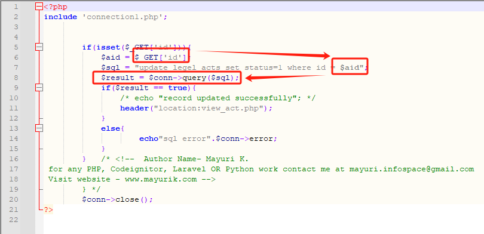
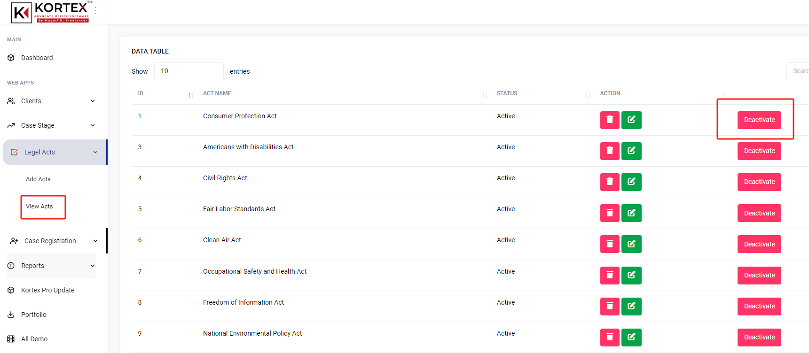
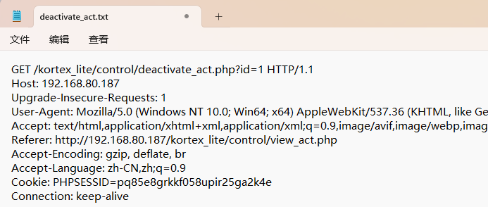
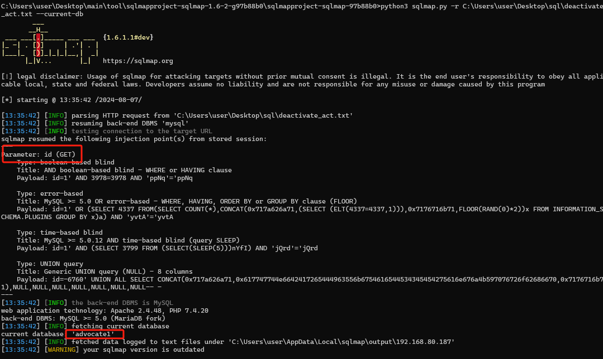

***\*A sql injection vulnerability in has been found in SourceCodester Kortex Lite Advocate Office Management System 1.0.(\****deactivate_act.php***\*)\****

***\*Explaination:\****

SQL injection errors occur when:

Data enters a program from an untrusted source.

The data is used to dynamically construct a SQL query.

***\*Target Code source:\****

https://www.sourcecodester.com/php/17280/advocate-office-management-system-free-download.html

 

***\*Url\****:  /kortex_lite/control/deactivate_act.php

***\*Abstract\****:

SQL Injection vulnerability in Kortex Lite Advocate Office Management System v.1.0 allows an attacker to execute arbitrary code via a crafted payload to the id parameter in the deactivate_act.php component.

.

***\*Details:\****

In this case the data is passed to exec() in deactivate_act.php at line 8.

 

We can find the deactivate_act.php interface in View Act->Action(Deactivate).

 

 

 sqlmap.py -r deactivate_act.txt --current-db

 

GET parameter 'id' is vulnerable.

