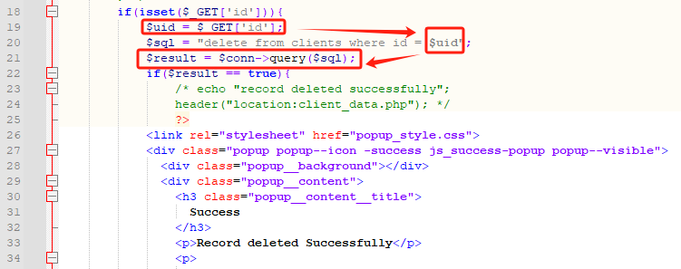
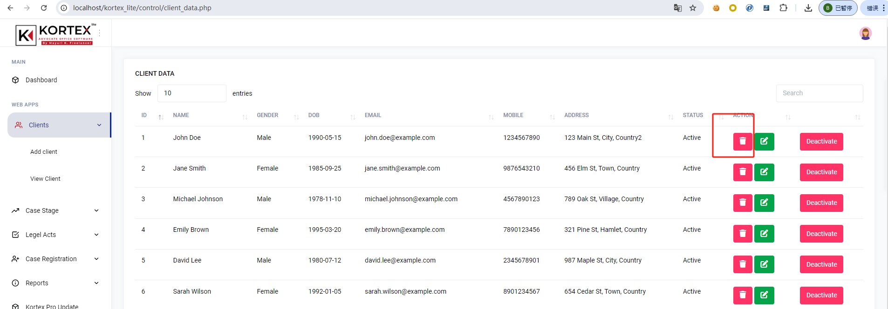
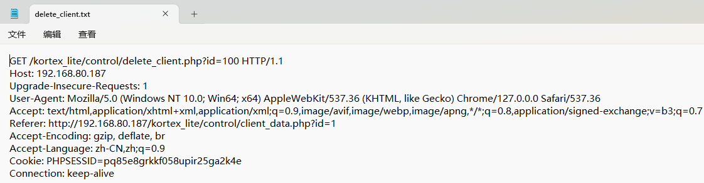
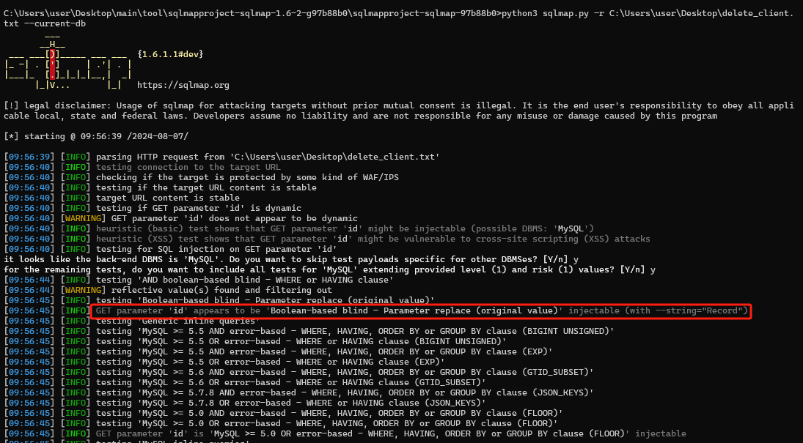
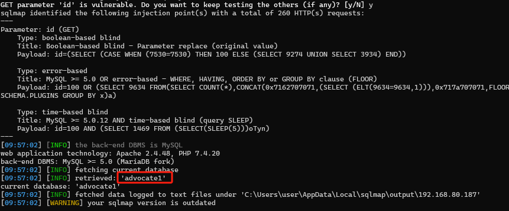

# ***\*A sql injection vulnerability in has been found in SourceCodester Kortex Lite Advocate Office Management System 1.0.(\****delete_client.php***\*)\****

***\*Explaination:\****

SQL injection errors occur when:

Data enters a program from an untrusted source.

The data is used to dynamically construct a SQL query.

***\*Target Code source:\****

https://www.sourcecodester.com/php/17280/advocate-office-management-system-free-download.html

***\*Url:\****  /kortex_lite/control/delete_client.php

***\*Abstract:\****

SQL Injection vulnerability in Kortex Lite Advocate Office Management System v.1.0 allows an attacker to execute arbitrary code via a crafted payload to the id parameter in the delete_client.php component.

***\*Details:\****

In this case the data is passed to query() in delete_client.php at line 21.

 

We can find the delete_client.php interface in Clients->Action.

 

 sqlmap.py -r delete_client.txt --current-db

  

GET parameter 'id' is vulnerable.

