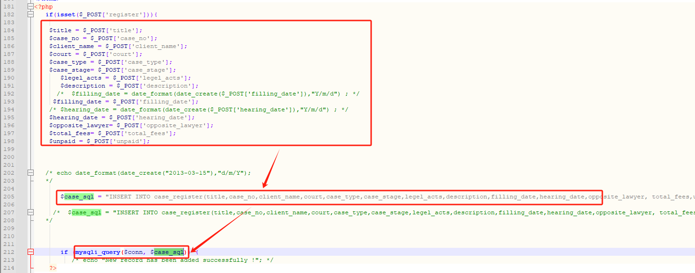
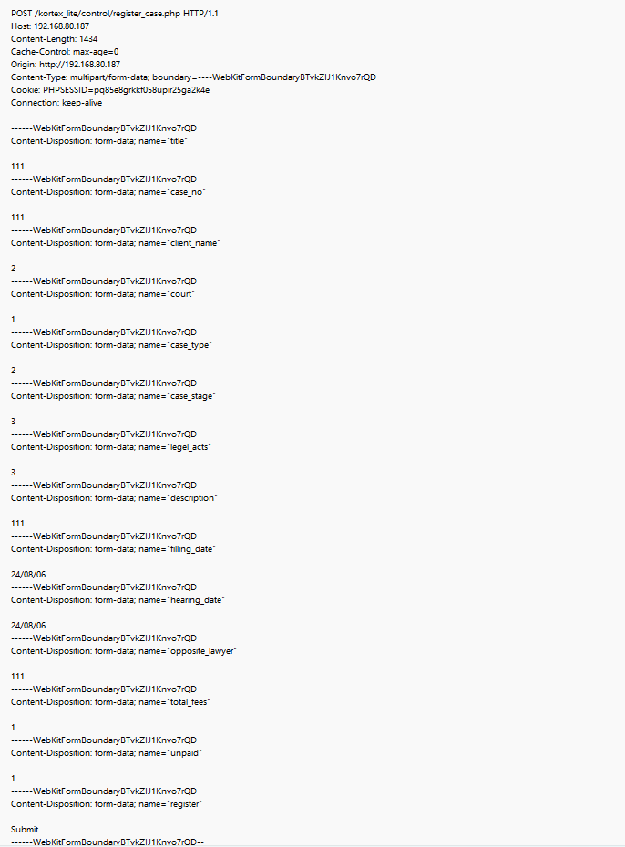
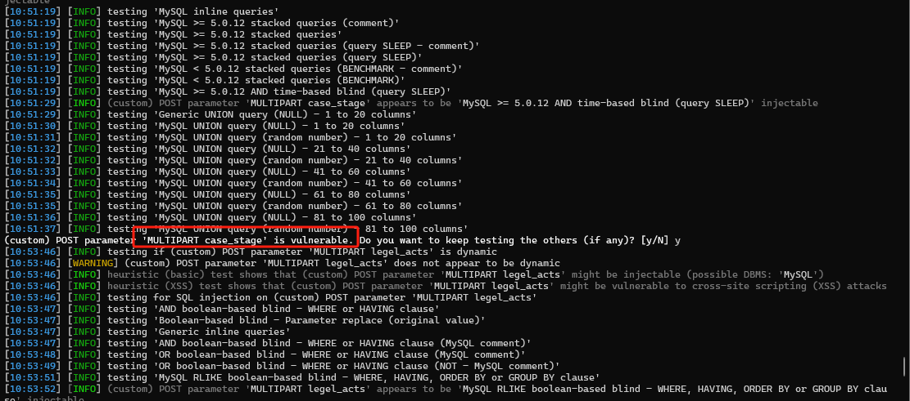
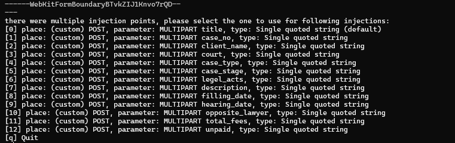
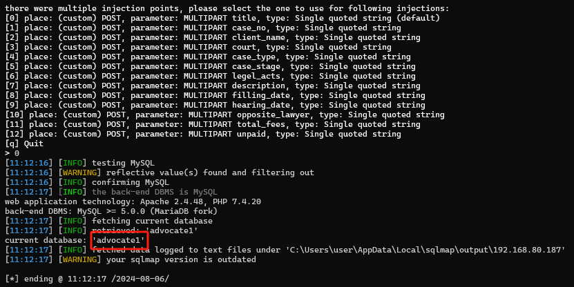

***\*A sql injection vulnerability in has been found in SourceCodester Kortex Lite Advocate Office Management System 1.0.(\****register_case.php***\*)\****

***\*Explaination:\****

SQL injection errors occur when:

Data enters a program from an untrusted source.

The data is used to dynamically construct a SQL query.

***\*Target Code source:\****

https://www.sourcecodester.com/php/17280/advocate-office-management-system-free-download.html

***\*Url\****:  /kortex_lite/control/register_case..php

***\*Abstract\****:

The SQL statement executed in 212 lines of code is composed of external input collages. Due to the lack of filtering or precompilation, attackers can achieve SQL injection by constructing statements through annotations.

***\*Details:\****

In this case the data is passed to exec() in add_act.php at line 212.

 

 sqlmap.py -r sql_test3.txt

 

13 parameters(title\case_no\client_name\court\case_type\case_stage\legel_acts\description\filling_date\hearing_date\opposite_lawyer\total_fees\unpaid) all have SQL injection vulnerabilities

sqlmap.py -r sql_test3.txt --current-db

