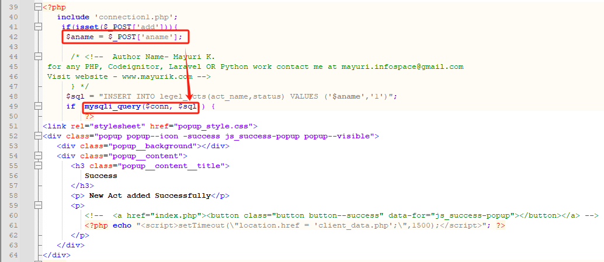

# XSS in SourceCodester Kortex Lite Advocate Office Management System 1.0 (add_act.php)

***\*url\****：control/add_act.php and control/view_act.php 

 

***\*Abstract\****:

 

Line 49 of add_act.php sends unvalidated data to a web browser, which can result in the browser executing malicious code in view_act.php at line 71.

 

***\*Explanation\****:

 

Cross-site scripting (XSS) vulnerabilities occur when:

 

Data enters a web application through an untrusted source. In the case of persistent (also known as stored) XSS, the untrusted source is typically a database or other back-end data store, while in the case of reflected XSS it is typically a web request.

In this case, the data enters at query() in add_act.php at line 49.

 

The data is included in dynamic content that is sent to a web user without being validated.

In this case, the data is sent in view_act.php at line 71.

 

It is clear that the application doesn’t perform data validation and trust user-supplied data, we can use the below XSS payload as input which may be stored in the application.

 

 

 