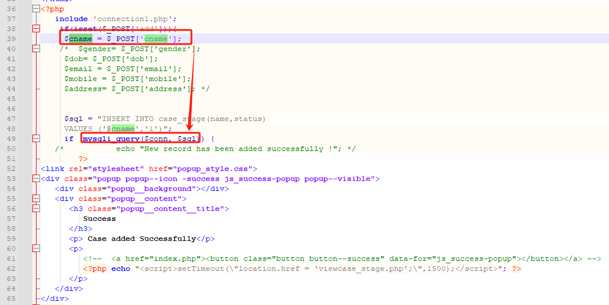
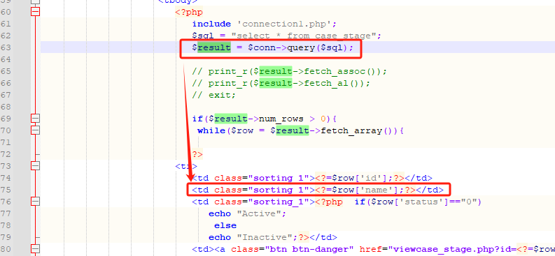
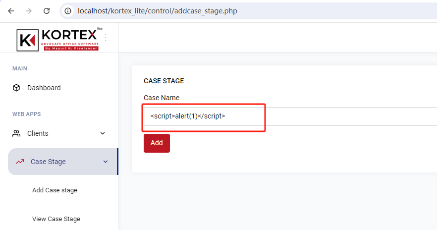
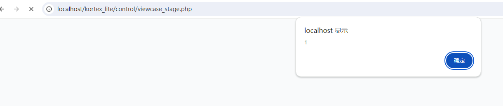

# XSS in SourceCodester Kortex Lite Advocate Office Management System 1.0 (addcase_stage.php)

***\*url\****：control/register_case.php and control/case_report.php 

 

***\*Abstract\****:

 

Line 212 of register_case.php sends unvalidated data to a web browser, which can result in the browser executing malicious code in case_report.php at line 77-94.

 

***\*Explanation\****:

 

Cross-site scripting (XSS) vulnerabilities occur when:

Data enters a web application through an untrusted source. In the case of persistent (also known as stored) XSS, the untrusted source is typically a database or other back-end data store, while in the case of reflected XSS it is typically a web request.

In this case, the data enters at query() in register_case.php at line 212.

 

The data is included in dynamic content that is sent to a web user without being validated.

In this case, the data is sent in case_report.php at line 77-94.

 

It is clear that the application doesn’t perform data validation and trust user-supplied data, we can use the below XSS payload as input which may be stored in the application.

